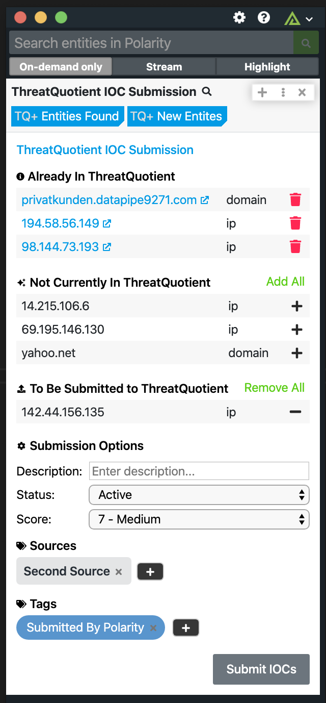

# Polarity ThreatQuotient Integration

The Polarity ThreatQuotient integration allows Polarity to search your instance of ThreatQuotient to return found domains, IPs, hashes, and emails.  The integration also allows you to Create and Delete Indicators (IOCs) in bulk from ThreatQuotient.

  

## ThreatQuotient Integration Options

### ThreatQuotient Instance URL
The URL of the ThreatQuotient instance you would like to connect to (including http:// or https://).  If you are running an internal instance of ThreatQuotient on a non-default port, please specify the port here as well.

### Username
Your TQ username you want the integration to authenticate as (typically an email address)

### Password
The password for the provided username you want the integration to authenticate as

### Client ID
The Client ID for your ThreatQuotient deployment.  (accessible at https://<yourserver>/assets/js/config.js)

### Allow IOC Deletion
If checked, users will be able to delete an Indicator from ThreatQuotient. (this setting must be set to `User can view only`).
> ***NOTE***: When you delete an Indicator you are doing a deletion of the Indicator from the entire system.

### Possible Submission Statuses
This allows you to limit the possible "Status" dropdown options

## Installation Instructions

Installation instructions for integrations are provided on the [PolarityIO GitHub Page](https://polarityio.github.io/).

## Polarity

Polarity is a memory-augmentation platform that improves and accelerates analyst decision making.  For more information about the Polarity platform please see:

https://polarity.io/
